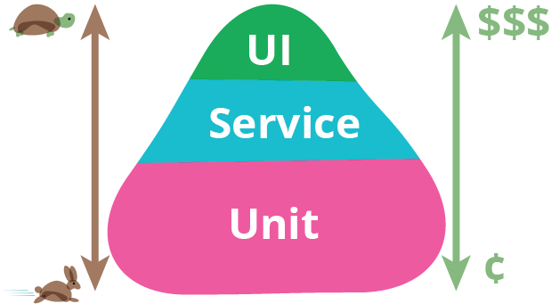
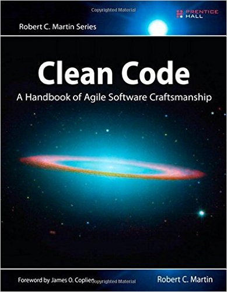
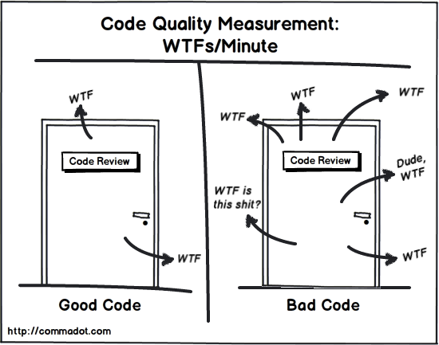

# Testing web applications

### (with a real demo)

<br><br>

by <font color="#2196F3">*Adrián Moreno*</font>, <font color="#2196F3">*Guillermo Guerrero*</font>, and <font color="#2196F3">*Jordi Pujol*</font>
<br>
@ *Tarragona Developers Meetup - 25/01/2017*

---

## The demo app

<table>
  <tr>
    <td>
      <ul>
        <li>Django application</li>
        <li>Based on this book ⟶</li>
        <li>TODO list</li>
        <li>Deployed to Heroku</li>
        <li>3rd party integrations</li>
      </ul>
    </td>
    <td>

    </td>
  </tr>
</table>

github.com/tgndevs/superlists

---

## Why testing software is important?

<br>

* <!-- .element: class="fragment" -->Gives you confidence
* <!-- .element: class="fragment" -->Fix and prevent bugs
* <!-- .element: class="fragment" -->Provide support for refactoring
* <!-- .element: class="fragment" -->Enables teams to move quicker

---

# Types of tests

----

## Unit tests

<br>

* Test the application from the **inside**
* **Small pieces** of code, typically individual functions
* Provide input -> validate output
* If test has external dependencies, **mock** (or stub) them
* Typically **fast** and quick to debug

----

```
import unittest

class TestStringMethods(unittest.TestCase):

    def test_upper(self):
        self.assertEqual('foo'.upper(), 'FOO')

    def test_isupper(self):
        self.assertTrue('FOO'.isupper())
        self.assertFalse('Foo'.isupper())

    def test_split(self):
        s = 'hello world'
        self.assertEqual(s.split(), ['hello', 'world'])
        # check that s.split fails when the separator is not a string
        with self.assertRaises(TypeError):
            s.split(2)
```

```
...
----------------------------------------------------------------------
Ran 3 tests in 0.012s

OK
```

----

## Functional tests

<br>

* a.k.a Acceptance, End-to-End, Black box, Browser testing
* Test the application from the **outside**
* Based on a **User Story** - user interactions
  * e.g.. registering an account, sending a message to another user, ...
* Also negative scenarios
* Selenium:
  * ChromeDriver, FirefoxDriver, PhantomJSDriver, ...

----

## Other types

<br>

* UI and Usability Testing
* <!-- .element: class="fragment" -->Accessibility Testing
* <!-- .element: class="fragment" -->Browser compatibility Testing
* <!-- .element: class="fragment" -->Integration Testing
* <!-- .element: class="fragment" -->Performance Testing
* <!-- .element: class="fragment" -->Security Testing

---

<!-- .slide: class="two-floating-elements" -->

## Useful guidelines

* Pyramid structure
  *	*&#35; Unit tests > &#35; UI Tests*
* <!-- .element: class="fragment" -->Speed
  * *&#35; check-ins tradeoff*
  * *Fast - parallel execution?*
* <!-- .element: class="fragment" -->Robustness
  * *No external dependencies*
  * *No random fails*
* <!-- .element: class="fragment" -->Debugging
  * *Tests as debugging tool*



---

<!-- .slide: class="two-floating-elements" -->

## Code quality

* Good tests, good coverage
* <!-- .element: class="fragment" -->Code review - Pair programming
* <!-- .element: class="fragment" -->Validate with standards - linters
* <!-- .element: class="fragment" -->Reduce complexity
* <!-- .element: class="fragment" -->Design patterns - Best practices
* <!-- .element: class="fragment" -->...



----



---

## TDD or not TDD?


----

## TDD Cycle


---

# Demo app

---

# Thank you

## Questions?

<br><br><br>

<font size="22">
[tgndevs.github.io/superlists](http://tgndevs.github.io/superlists)
</font>
